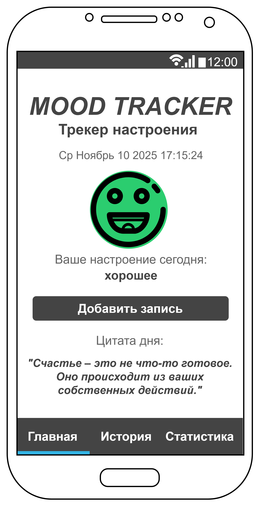
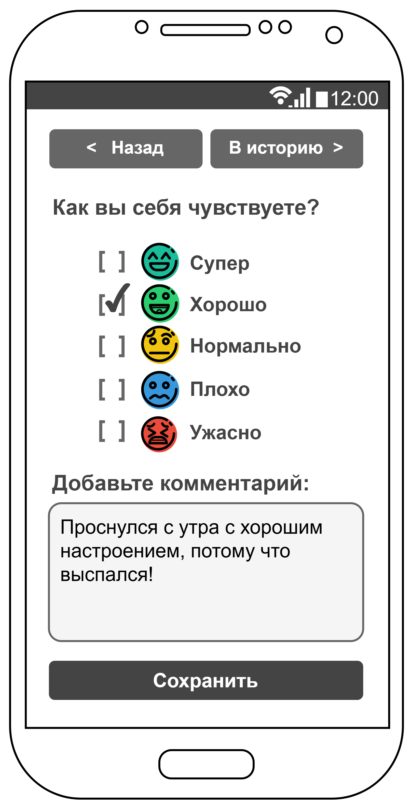
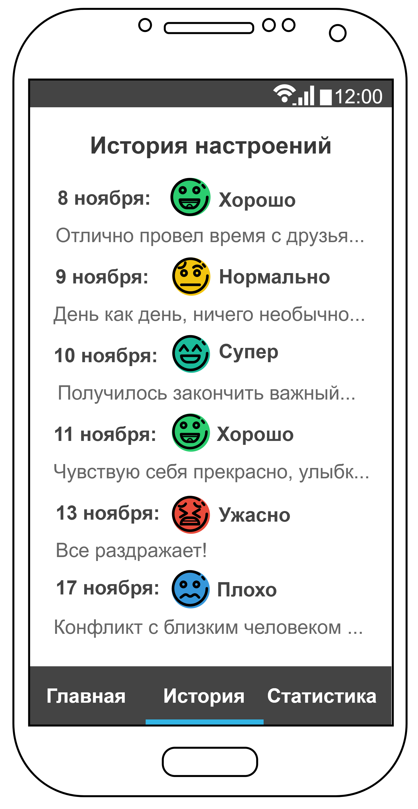
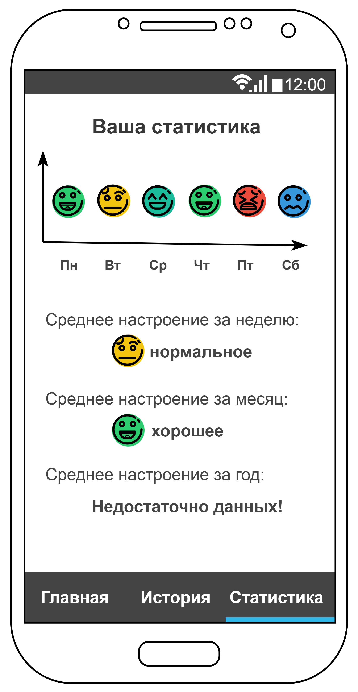

# Mood Tracker (Трекер настроения)

### Техническая информация
- **Язык программирования**: Dart
- **Фреймворк**: Flutter
- **Минимальная версия SDK**: Android 21 (Android 5.0)

### Краткое описание
Mood Tracker — это мобильное приложение, которое помогает пользователям отслеживать свое 
эмоциональное состояние. Пользователь может ежедневно вносить запись о своем настроении,
добавлять краткое описание и просматривать историю своих записей для выявления паттернов.

### Основные функции (MVP)

1. **Главный экран**: Отображение текущего настроения и кнопка для добавления новой записи.
2. **Экран добавления записи**: Возможность выбрать настроение из предустановленного списка 
и добавить текстовый комментарий.
3. **История записей**: Просмотр списка всех предыдущих записей о настроении, отсортированных 
по дате.
4. **Статистика**: Простой график, показывающий динамику настроения за последнюю неделю.
5. **Мотивирующая цитата**: На главном экране отображается случайная мотивирующая цитата, 
загружаемая из публичного API.

### Структура экранов

**Экран 1: Главный (HomeScreen)**

**Экран 2: Добавление записи (AddEntryScreen)**

**Экран 3: История (HistoryScreen)**

**Экран 4: Статистика (StatsScreen)**

### Сценарии использования

1. **Просмотр главного экрана:**
    - Пользователь открывает приложение
    - Видит свое настроение за сегодня (если запись уже была сделана)
    - Видит новую мотивирующую цитату
    - Может перейти в другие разделы через нижнюю панель навигации

2. **Добавление новой записи о настроении:**
    - Пользователь нажимает на кнопку "Добавить запись" на главном экране
    - Открывается экран добавления записи
    - Пользователь выбирает эмоцию из списка
    - Вводит текстовый комментарий (опционально)
    - Нажимает "Сохранить"
    - Приложение возвращает его на главный экран, где теперь отображается только что 
      введенное настроение

3. **Просмотр истории:**
    - Пользователь переходит в раздел "История" через нижнюю панель навигации
    - Просматривает список всех своих предыдущих записей

4. **Просмотр статистики:**
    - Пользователь переходит в раздел "Статистика"
    - Видит график своего настроения за последние 7 дней и среднее значение

### Навигация

Навигация в приложении будет реализована с помощью нижней панели навигации 
для переключения между основными разделами: **Главная**, **История** и **Статистика**.

- С **главного экрана** при нажатии на кнопку "Добавить запись" происходит переход на экран 
**добавления записи**.
- Экран **добавления записи** имеет собственные кнопки "Назад" для возврата на главный экран
и "В историю" для просмотра истории записей.